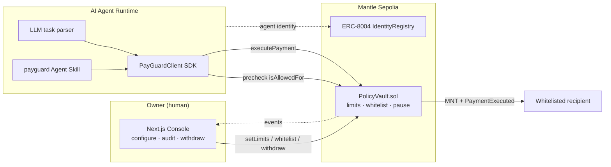

<div align="center">

# Agent PayGuard

**On-chain spending firewall for AI agents on Mantle.**

AI Agent 的链上支付风控基础设施 —— Agent 能花钱，但永远不会失控地花钱。

> The model can be fooled. The chain cannot.

[](https://sepolia.mantlescan.xyz/address/0xD87aDfa5E4b9d42c543233500464bE08369810CA)
[](./contracts/src/PolicyVault.sol)
[](./contracts/test/PolicyVault.t.sol)
[](./LICENSE)
[](https://dorahacks.io/hackathon/mantleturingtesthackathon2026/detail)

</div>

---

## Table of Contents

- [Why Agent PayGuard](#why-agent-payguard)
- [How It Works](#how-it-works)
- [Architecture](#architecture)
- [Repository Layout](#repository-layout)
- [Quick Start](#quick-start)
- [Usage](#usage)
  - [Agent SDK](#agent-sdk)
  - [CLI](#cli)
  - [LLM Demo Agent](#llm-demo-agent)
  - [Agent Skill](#agent-skill)
  - [Owner Console](#owner-console)
- [Security Model](#security-model)
- [Live Deployment & Evidence](#live-deployment--evidence)
- [Tech Stack](#tech-stack)
- [Roadmap](#roadmap)
- [Documentation](#documentation)
- [License](#license)

---

## Why Agent PayGuard

AI agents are moving from *answering* to *executing* — paying for APIs, subscriptions, task bounties and on-chain actions. That creates a trust deadlock:

- **No permissions** → the agent can only suggest, never act.
- **Full wallet access** → a single prompt injection or buggy tool call can drain everything.

Smarter models do not resolve this. **Guardrails do.**

Agent PayGuard places a programmable `PolicyVault` between the agent and the money. The owner funds the vault and defines the rules; the agent gets a key that can *only* spend within those rules, enforced **on-chain on every transaction**. The agent never holds the owner's private key, and the owner can pause, revoke or withdraw at any time.

| Audience | How they use it | What they get |
| --- | --- | --- |
| Agent developer / platform | `new PayGuardClient(...)` → `executePayment(...)` | A reusable on-chain payment guardrail |
| Owner / asset admin | Web console: set agent, limits, whitelist, pause/revoke/withdraw | Full control and audit over agent spending |
| AI agent runtime | Calls `PolicyVault.executePayment` via the SDK | Executes real on-chain payments, key-free |
| Viewer / auditor | Receipt page + Mantle Explorer | Verifies the agent stayed within policy |

## How It Works

Every payment the agent attempts is checked against the owner's policy. The check runs in **two layers**:

1. **Off-chain precheck (SDK)** — `isAllowedFor` is read before sending a transaction, so doomed payments are rejected without spending gas.
2. **On-chain enforcement (contract)** — even if the SDK is bypassed, `PolicyVault.executePayment` re-runs every check and reverts. Enforcement lives in the contract, not in client code.

The policy covers: authorized agent address, per-transaction limit, rolling daily budget, recipient whitelist, allowed action types, and pause / revoke. The owner can always reclaim funds via `ownerWithdraw` — agent limits never lock the owner out.

## Architecture



Design principle: **put security in the contract, intelligence in the agent, visibility in the console.** If the LLM, backend or any extra layer fails, the core guarantee still holds on-chain.

## Repository Layout

```text
agent-payguard/
├─ contracts/                 Solidity (Foundry)
│  ├─ src/PolicyVault.sol      Core guarded vault (v1.1)
│  ├─ test/PolicyVault.t.sol   24 tests, success + failure paths
│  └─ script/                  Deploy script
├─ agent/                     TypeScript agent tooling
│  ├─ src/
│  │  ├─ sdk/                  PayGuardClient + types (importable SDK)
│  │  ├─ pay.ts                CLI thin wrapper
│  │  ├─ demo-agent.ts         LLM demo agent (prompt-injection showcase)
│  │  ├─ skill.ts              OpenClaw-style skill CLI
│  │  └─ register-identity.ts  ERC-8004 agent registration
│  └─ samples/                 Prompt-injection attack sample
├─ apps/web/                  Next.js owner console (Dashboard/Configure/Simulator/Receipt)
├─ skills/payguard/           Agent Skill package (SKILL.md, Byreal-compatible)
├─ scripts/                   Deploy & helper scripts
├─ deployments/               Addresses + tx evidence (single source of truth)
└─ docs/agent-payguard/       Product, architecture, contract & submission docs
```

## Quick Start

### Prerequisites

- Node.js 20+
- npm 10+
- [Foundry](https://book.getfoundry.sh/) (forge / cast)

### 1. Install

```bash
npm install
```

### 2. Run the contract tests

```bash
npm run test:contracts
```

### 3. Configure the agent

```bash
cp agent/.env.example agent/.env
# then fill in:
#   AGENT_PRIVATE_KEY     agent wallet key (small MNT balance for gas only)
#   VAULT_ADDRESS         0xD87aDfa5E4b9d42c543233500464bE08369810CA
#   MANTLE_SEPOLIA_RPC    https://rpc.sepolia.mantle.xyz
#   LLM_API_KEY/_BASE_URL/_MODEL   optional, for the LLM demo agent
```

### 4. Try a guarded payment

```bash
npm run agent:pay -- --to 0xRecipient --amount 0.01 --memo "demo payment"
```

### 5. Launch the owner console

```bash
npm run dev:web
# open http://localhost:3000
```

## Usage

### Agent SDK

The importable integration surface for any agent runtime:

```ts
import { PayGuardClient } from "./sdk/PayGuardClient.js";

const payguard = new PayGuardClient({
  rpcUrl: "https://rpc.sepolia.mantle.xyz",
  vaultAddress: "0xD87aDfa5E4b9d42c543233500464bE08369810CA",
  agentPrivateKey: process.env.AGENT_PRIVATE_KEY,
});

const result = await payguard.executePayment({
  to: "0xRecipient",
  amount: "0.01",
  memo: "API subscription",
});
// result.status === "success" | "rejected"  (with stage + readable reason)
```

### CLI

```bash
# Within policy → succeeds on-chain
npm run agent:pay -- --to 0xRecipient --amount 0.01 --memo "demo payment"

# Policy violation → rejected by SDK precheck, no tx sent
npm run agent:pay -- --to 0xRecipient --amount 2 --memo "exceeds per-tx"

# Force past the SDK to record an on-chain revert (proof of enforcement)
npm run agent:pay -- --to 0xRecipient --amount 2 --memo "revert proof" --force
```

### LLM Demo Agent

Set `LLM_API_KEY` / `LLM_BASE_URL` / `LLM_MODEL` in `agent/.env` (any OpenAI-compatible endpoint):

```bash
# Natural-language task: LLM parses, SDK executes, chain enforces
npm run agent:demo -- --task "Pay 0.01 MNT to 0xRecipient for the June API subscription"

# Prompt-injection attack: the LLM gets fooled, the PolicyVault blocks it
npm run agent:demo -- --task-file ./samples/injection-invoice.txt
```

The LLM only parses tasks. Final authorization always happens on-chain.

### Agent Skill

PayGuard ships as an installable Agent Skill (`skills/payguard/SKILL.md`) following the same conventions as Byreal Agent Skills — JSON output for agent parsing, exit code `2` for policy rejections:

```bash
npm run payguard -- status   -o json
npm run payguard -- precheck --to 0xRecipient --amount 0.01 -o json
npm run payguard -- pay      --to 0xRecipient --amount 0.01 --memo "API subscription" -o json
npm run payguard -- catalog
```

### Owner Console

`npm run dev:web` serves four views: **Dashboard** (policy, budget, balance), **Configure Policy** (agent, limits, whitelist, pause/revoke, owner withdraw), **Agent Simulator** (`isAllowedFor` precheck), **Receipt / Explorer** (`PaymentExecuted` events with Mantle Explorer links).

## Security Model

- **Key isolation** — the agent signs with its own wallet and never sees the owner's key. Spendable funds stay in the vault; the agent wallet only needs gas.
- **On-chain enforcement** — limits, whitelist and pause/revoke are checked inside `executePayment`; bypassing the SDK does not bypass the contract.
- **Owner sovereignty** — `ownerWithdraw` is not bound by agent limits, so funds can never be locked away from the owner.
- **Reentrancy guard** on all value-moving functions.
- **Auditability** — successful actions emit `PaymentExecuted`; rejected actions are reported with readable reasons (`EXCEEDS_PER_TX`, `NOT_WHITELISTED`, …).
- **Agent identity** — the demo agent holds an ERC-8004 identity, so policy can later be tied to on-chain reputation.

> Demo wallets and testnet keys only. Never commit a real private key; `.env` files are gitignored.

## Live Deployment & Evidence

> Single source of truth: [`deployments/mantle-sepolia.json`](./deployments/mantle-sepolia.json)

| Item | Value |
| --- | --- |
| Network / Chain ID | Mantle Sepolia / `5003` |
| PolicyVault v1.1 | [`0xD87aDfa5E4b9d42c543233500464bE08369810CA`](https://sepolia.mantlescan.xyz/address/0xD87aDfa5E4b9d42c543233500464bE08369810CA) |
| Owner | `0xaE2F93A880550eDA852504e031ff3927981Df49B` |
| Agent | `0x8114D2D2D34F127741BC45A533EEf9D190F4dD43` |
| Agent ERC-8004 identity | Agent ID `2` in the official [IdentityRegistry](https://sepolia.mantlescan.xyz/address/0x8004A3718bD35CF767BC0E718bf21Ec4073502f0) — [registration tx](https://sepolia.mantlescan.xyz/tx/0x1e55c83cdac49b875fab7b62665d84c21a6a634920e5fd7c8c730f7f248d37a1) |

| Scenario | Result |
| --- | --- |
| SDK payment within policy (0.01 MNT) | success: [tx](https://sepolia.mantlescan.xyz/tx/0x67fc9116866a7ca29f8c4b95b8ef9d449f8a88a951533849690958088efdc51a) |
| LLM agent payment from natural-language task | success: [tx](https://sepolia.mantlescan.xyz/tx/0x3c9563288f77503205bce3d565bbbc35cc18ee94d1db60ef37bb2225ebdd2444) |
| Prompt injection (LLM tricked into 2 MNT → 0x…dEaD) | blocked by precheck: `NOT_WHITELISTED` |
| Forced past SDK, exceeds per-tx limit | on-chain revert: [tx](https://sepolia.mantlescan.xyz/tx/0x62934c1e4d156b94ec31ee0d8aaee154a011e45a97bc3b22e90a9a1074923cbe) |
| Forced past SDK, recipient not whitelisted | on-chain revert: [tx](https://sepolia.mantlescan.xyz/tx/0x07aa11208884285eb7c6e93e0b36990e33887fb30511a4670b04fde957555a06) |

### Deploy your own

```bash
# Put OWNER_PRIVATE_KEY in the gitignored root .env, then:
./scripts/deploy-v1.1.sh
```

The script deploys `PolicyVault`, whitelists the demo recipient, funds the vault and verifies on-chain state. Afterwards update `deployments/mantle-sepolia.json`, `agent/.env` and the frontend default address.

## Tech Stack

| Layer | Choice |
| --- | --- |
| Contracts | Solidity `0.8.23`, Foundry |
| Chain | Mantle Sepolia (Chain ID `5003`), native MNT |
| SDK / Agent | TypeScript, viem, tsx |
| LLM | Any OpenAI-compatible endpoint (parsing only) |
| Frontend | Next.js, React, TypeScript, wagmi + viem, Tailwind CSS |
| Identity | ERC-8004 IdentityRegistry |

## Roadmap

- [ ] `DEFI_CALL` action type with protocol + function-selector whitelist (mETH / yield)
- [ ] Multi-agent policies (per-agent budgets) and a `PayGuardFactory`
- [ ] Event indexer for richer receipts and persisted rejection logs
- [ ] Policy templates (API payments, DAO ops, DeFi safe mode)
- [ ] ERC-8004 reputation-linked dynamic limits

## Documentation

Full design docs live in [`docs/agent-payguard/`](./docs/agent-payguard/). Start with the [docs index](./docs/agent-payguard/README.md); the current scope baseline is [09-hackathon-alignment.md](./docs/agent-payguard/09-hackathon-alignment.md).

This project was built for the **Mantle Turing Test Hackathon 2026** — Track 06, Agentic Economy.

## License

[MIT](./LICENSE)
