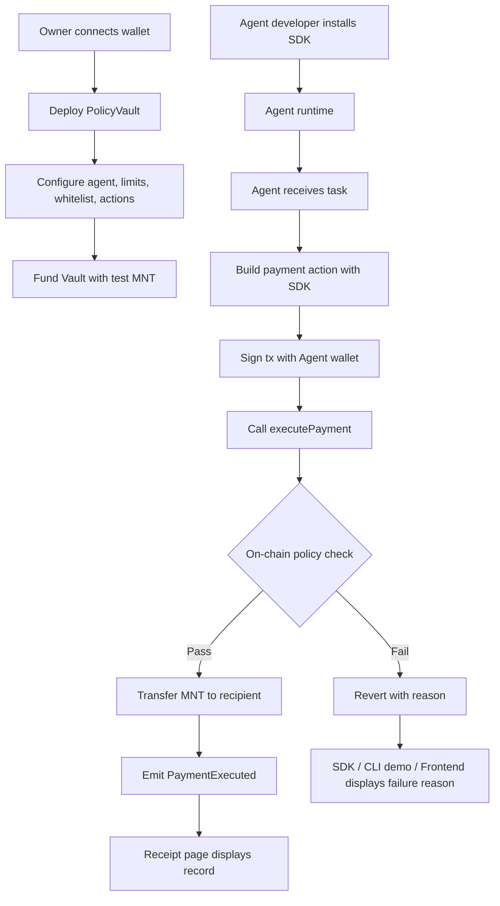
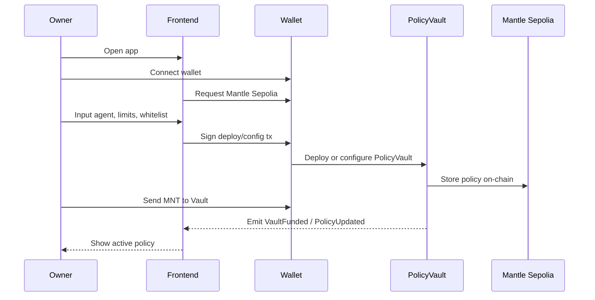
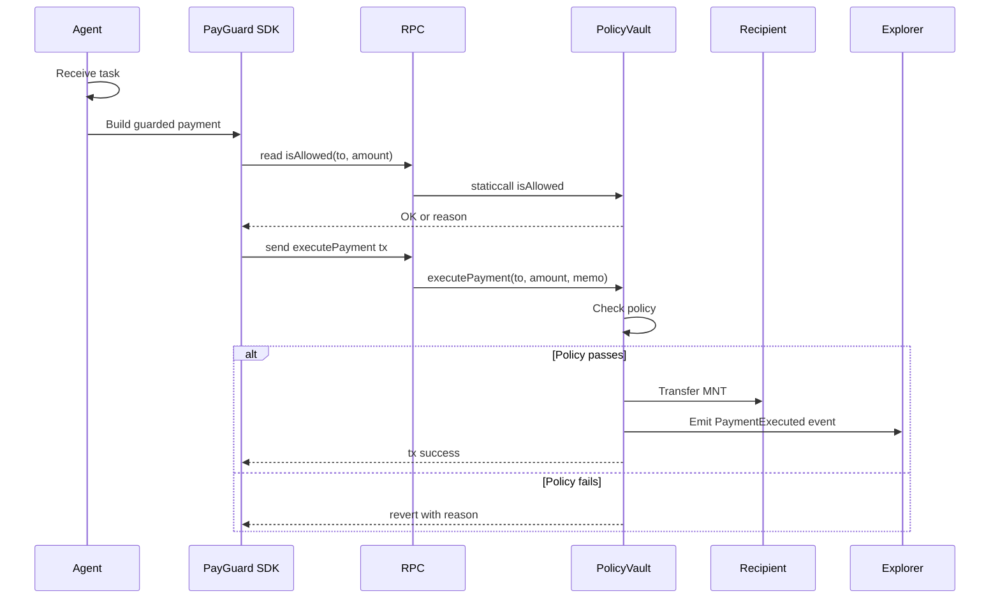
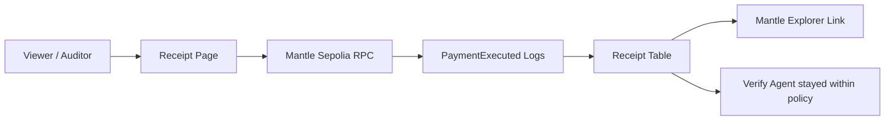

# 02. 核心用户流程

## 角色定义

| 角色 | 说明 | MVP 中的表现 |
| --- | --- | --- |
| User / Owner | 资产所有者，拥有 PolicyVault 管理权 | 连接钱包、部署 Vault、设置规则、存入 MNT |
| Agent Developer / Platform | 把 PayGuard 接入 Agent 的开发者或平台 | 当前参考 CLI Demo；下一步使用 SDK/package |
| AI Agent | 被授权执行任务的独立执行者 | 使用 Agent 私钥调用 `executePayment` |
| Recipient / Protocol | 收款方或后续 DeFi 协议 | Demo 中先用白名单收款地址 |
| Viewer / Auditor | 查看 Agent 执行记录的人 | 在 Receipt 页面查看事件和 Explorer 链接 |

## 总流程图

## 用户创建流程

### 目标

让 Owner 创建一个受控资金 Vault，并授予某个 Agent 地址有限执行权。

### 步骤

1. 用户打开前端。
2. 用户连接钱包，网络切换到 Mantle Sepolia。
3. 用户输入 Agent 地址。
4. 用户设置单笔限额，例如 `1 MNT`。
5. 用户设置每日限额，例如 `10 MNT`。
6. 用户添加白名单收款地址，例如服务商地址 `0xRecipient`。
7. 用户开启允许 Action：`PAYMENT`。
8. 用户部署 PolicyVault 或初始化配置。
9. 用户向 PolicyVault 存入测试 MNT。
10. 前端 Dashboard 展示当前 Policy 状态。

### 创建流程图

## Agent 执行流程

### 目标

Agent 不接触 Owner 私钥，只使用自己的 Agent 钱包通过 SDK 调用 PolicyVault。当前 MVP 的 CLI 是 SDK 化前的可视化 Demo wrapper。

### 步骤

1. Agent 收到任务，例如：`pay 0.01 MNT to 0xRecipient`。
2. Agent workflow 或 PayGuard SDK 解析任务，得到 `to`、`amount`、`memo`。
3. Agent 可选调用 `isAllowed(to, amount)` 做预检查。
4. Agent 构造 `executePayment(to, amount, memo)` 交易。
5. Agent 用自己的私钥签名。
6. PolicyVault 检查：
   - `msg.sender == agent`
   - Agent 未暂停
   - Agent 未撤销
   - `PAYMENT` action 被允许
   - 收款地址在白名单内
   - 金额不超过单笔限额
   - 今日累计不超过每日限额
7. 通过则转账并发事件。
8. 不通过则 revert，SDK / CLI Demo 输出失败原因。

### 执行流程图

## 审计查看流程

### 目标

让 Owner、评委或第三方能验证 Agent 是否按照规则运行。

### 步骤

1. Viewer 打开 Receipt / Explorer 页面。
2. 输入或读取当前 PolicyVault 地址。
3. 前端从 Mantle Sepolia RPC 查询 `PaymentExecuted` 事件。
4. 前端展示：
   - tx hash
   - block timestamp
   - Agent 地址
   - 收款地址
   - 金额
   - memo
   - daily spent after
   - Mantle Explorer 链接
5. 对失败动作：
   - MVP 中不在链上存储失败事件，因为 revert 不保留 logs。
   - 前端或 SDK / CLI Demo 展示本次失败原因。
   - Demo 中用屏幕展示失败提示即可。

### 审计流程图

## MVP 必须覆盖的三条演示路径

| 路径 | 输入 | 预期结果 | 展示重点 |
| --- | --- | --- | --- |
| 成功支付 | 白名单地址，金额小于单笔/每日限额 | 成功转账，发出事件 | Agent 能执行真实链上动作 |
| 超单笔限额 | 白名单地址，金额大于 `maxPerTx` | revert `ExceedsMaxPerTx` | Agent 不能超额 |
| 非白名单收款 | 非白名单地址，金额合理 | revert `RecipientNotWhitelisted` | Agent 不能随便转走资产 |
