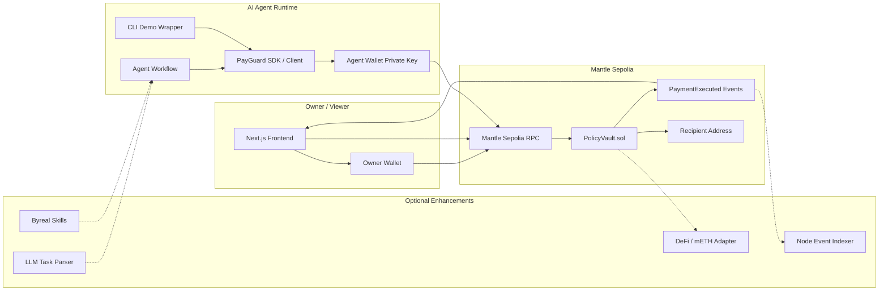
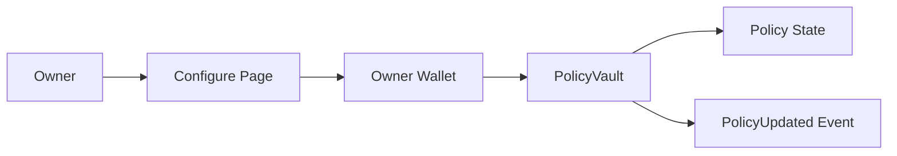
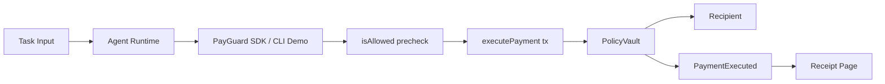

# 03. 技术架构

## 架构目标

Agent PayGuard 的架构目标是：

1. 保证黑客松 MVP 可以在 3-5 天内完成。
2. 核心逻辑尽量放在合约中，方便审计和 Demo。
3. Agent 是独立执行者，不使用 Owner 私钥，通过 SDK 调用受控合约接口。
4. 前端是 Owner 控制台，负责配置、查看和演示，不承担关键安全逻辑。
5. 后端不是 MVP 必需项，避免增加部署风险。

## 整体架构图

## 模块说明

| 模块 | 作用 | 技术选择 | MVP 是否必须 | 说明 |
| --- | --- | --- | --- | --- |
| PolicyVault 合约 | 存放资金、保存策略、执行 policy check、转账、发事件 | Solidity `^0.8.23` | 是 | 项目核心 |
| 合约测试 | 验证限额、白名单、权限、事件 | Foundry 或 Hardhat | 是 | 不做测试会很容易翻车 |
| 部署脚本 | 部署到 Mantle Sepolia | Foundry script / Hardhat deploy | 是 | 必须产出合约地址 |
| Next.js 前端 | Owner 控制台：配置策略、展示状态、展示事件 | Next.js + TypeScript | 是 | 给人使用，不是 Agent 日常付款入口 |
| 钱包连接 | Owner 配置合约 | wagmi + viem | 是 | 支持 Mantle Sepolia |
| PayGuard SDK + CLI Demo | SDK 是正式 Agent 集成方式；CLI 是黑客松可视化 Demo wrapper | Node.js + TypeScript + viem | 是 | 当前先实现 CLI，下一步抽出 `PayGuardClient` |
| Receipt 页面 | 查询和展示成功执行事件 | viem `getLogs` | 是 | 证明可审计 |
| 轻量后端 | 缓存事件、记录失败动作 | Node.js + SQLite | 否 | 1-2 周再考虑 |
| LLM Parser | 把自然语言解析成 payment action | OpenAI API 或本地规则 | 否 | MVP 不依赖 |
| DeFi Action | deposit/swap/yield | Adapter 合约 | 否 | 容易拖慢 |
| Byreal Skills | 让 Agent action 接入赛道 sponsor 工具 | Byreal Skills CLI | 可选 | 确认文档后接入 |

## MVP 必须做的模块

3-5 天内必须完成：

1. `PolicyVault.sol`
2. 合约测试
3. Mantle Sepolia 部署
4. 前端 Dashboard
5. 前端 Configure Policy
6. 前端 Receipt 页面
7. TypeScript Agent CLI Demo，或最小 `PayGuardClient` + CLI wrapper
8. README 和 Demo 命令

## 可以之后再做的模块

1. Factory。
2. 多 Agent 支持。
3. DeFi Adapter。
4. mETH deposit action。
5. Byreal Skills 集成。
6. LLM 自然语言解析。
7. 后端 Indexer。
8. Agent reputation。
9. AA / gasless。

## 不建议做的模块

MVP 阶段不要做：

| 模块 | 不建议原因 |
| --- | --- |
| 完整 AA 钱包 | 工程量大，容易偏离 PayGuard 核心 |
| 多链部署 | 黑客松需要 Mantle 聚焦，多链反而削弱叙事 |
| 复杂 DeFi 聚合 | 风险、接口、测试成本都高 |
| 高频交易策略 | 容易被 PnL、数据、风控拖死 |
| 后端大系统 | 部署和维护成本高 |
| 必须依赖 LLM 的核心流程 | LLM 不稳定会影响 Demo |

## 合约与前端边界

合约负责：

- 身份检查。
- 限额检查。
- 白名单检查。
- Action 类型检查。
- 暂停 / 撤销。
- 转账。
- 事件记录。

前端负责：

- 展示 policy。
- 发起 Owner 配置交易。
- 查询事件。
- 展示 Mantle Explorer 链接。
- 展示 Agent 执行结果。

Agent SDK / 脚本负责：

- 接收任务。
- 构造 action。
- 使用 Agent 钱包签名。
- 调用合约。
- 输出 tx hash 或失败原因。
- 提供可被 Agent workflow import 的稳定接口。

后端如果存在，只负责：

- 事件缓存。
- 更稳定的查询。
- 可选失败记录。

## 数据流

### 配置数据流

### 执行数据流

### 审计数据流

## 架构取舍

最重要的取舍是：**把安全能力放在合约，把智能程度放在 Agent，把可视化放在前端。**

这样 Demo 即使 LLM、后端或复杂 DeFi 没做完，项目核心仍然成立。
